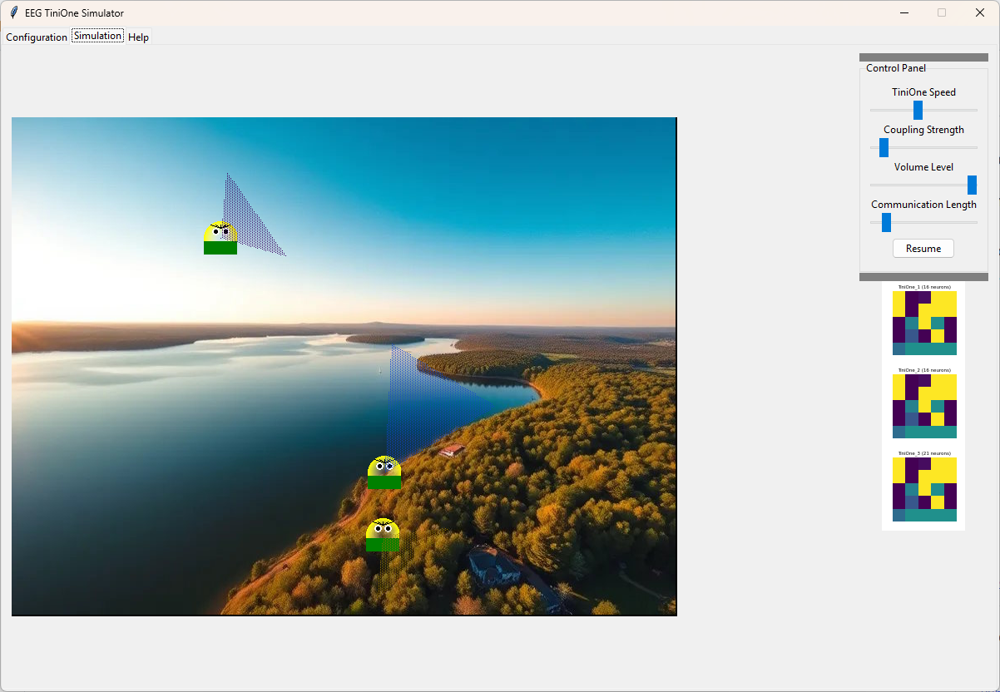

## EEG TiniOne Simulator and EEG AI Model Maker

# Overview

This repository contains two interconnected projects:

EEG TiniOne Simulator: An interactive simulation featuring agents called TiniOnes. These agents have neural networks modeled after
EEG data processing and exhibit emergent behaviors based on their interactions and environment.

EEG AI Model Maker: A tool for processing EEG data from EDF files, training an autoencoder neural network, and extracting latent 
features. The trained model can be used within the TiniOne Simulator to influence the behaviors of the TiniOnes.

# EEG TiniOne Simulator

Description

The EEG TiniOne Simulator is an interactive environment where TiniOnes move around, interact with each other, and respond to their
surroundings. Each TiniOne has a neural network brain that processes inputs and generates behaviors. The simulation includes
features such as adjustable vision cones, distance-based hearing, neuron boosts, and audio feedback.

# Features

Adjustable Vision Cones: TiniOnes can adjust their vision range and angle, focusing on distant or nearby objects. When theylook further, their vision cone becomes narrower.

Distance-Based Hearing: TiniOnes hear each other's sounds louder when closer and process these sounds in their neural networks. They also hear themselves slightly.

Neuron Boosts: Users can drop boosts to increase the number of neurons in a TiniOne's brain by double-clicking on the canvas.

Audio Feedback: TiniOnes generate sounds based on their neural activity, and sounds are louder when the mouse cursor is near them (audio zoom).

Interactive Controls: Users can pause/resume the simulation, adjust volume levels, set communication lengths, and move TiniOnes by clicking and dragging.

Requirements

Python 3.x

Dependencies:

numpy
torch
pillow
matplotlib
pygame
opencv-python
tkinter (usually included with Python)
mne (if EEG processing is involved)

# Installation

Install Python 3.x if not already installed.

Install the required dependencies using pip:

pip install numpy torch pillow matplotlib pygame opencv-python mne

# Running the Simulator

Ensure you have a trained EEG autoencoder model saved as a .pth file. This can be generated using the EEG AI Model Maker.

Run the simulator script:

python TiniOnes.py

In the GUI that appears:

Select the EEG model file.

Choose the input source (webcam or background image).

Configure the number of TiniOnes and wave neurons.

Start the simulation.

Interact with the simulation using the control panel and mouse actions.

# EEG AI Model Maker

Description

The EEG AI Model Maker is a tool that processes EEG data from EDF files, trains an autoencoder neural network, and extracts latent features
(hidden vectors). The resulting model can be used in the EEG TiniOne Simulator to influence the behaviors of the TiniOnes.

# Features

EDF File Processing: Reads EEG data from EDF files.
Data Preprocessing: Filters EEG data into specific frequency bands and normalizes it.
Autoencoder Training: Trains a neural network to learn latent representations of the EEG data.
Feature Extraction: Extracts hidden vectors from the trained model.

Requirements
Python 3.x
Dependencies:
numpy
torch
mne
scipy
tqdm
gradio

# Installation

Install Python 3.x if not already installed.

Install the required dependencies using pip:

pip install numpy torch mne scipy tqdm gradio

Running the Model Maker

Run the Gradio interface script:

python eeg_ai_model_maker.py

In the Gradio web interface that opens:

Upload your EDF file containing EEG data.

Configure parameters such as epoch length, batch size, number of epochs, learning rate, and latent dimension.

Click the "Process EEG Data" button.

Once processing is complete, download the trained model and hidden vectors.

# Notes

EEG Data: Ensure that you have appropriate EEG data in EDF format for training the autoencoder model.

Legal Considerations: Be mindful of any legal or ethical considerations regarding the use of EEG data.

Performance: Depending on the complexity of the models and the number of TiniOnes, performance may vary. Adjust parameters accordingly.

# License

This project is released under the MIT License.
